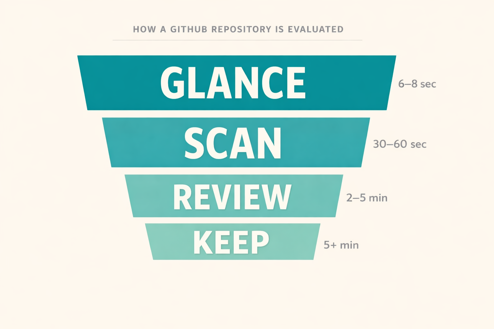
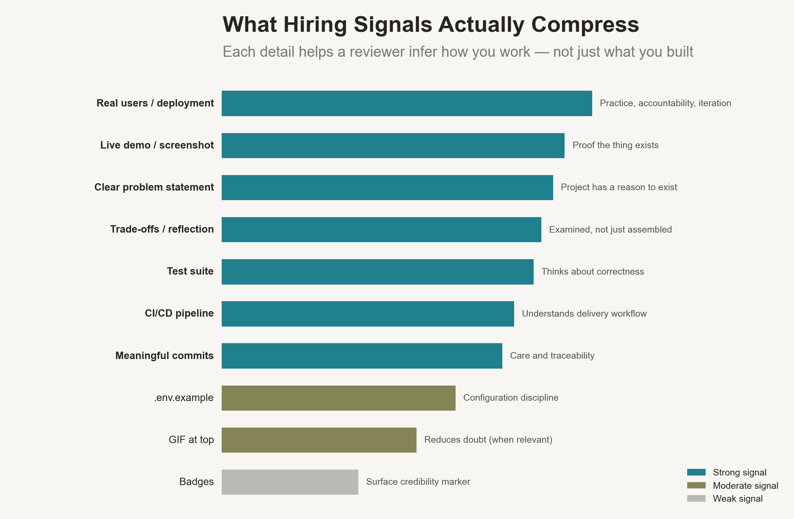
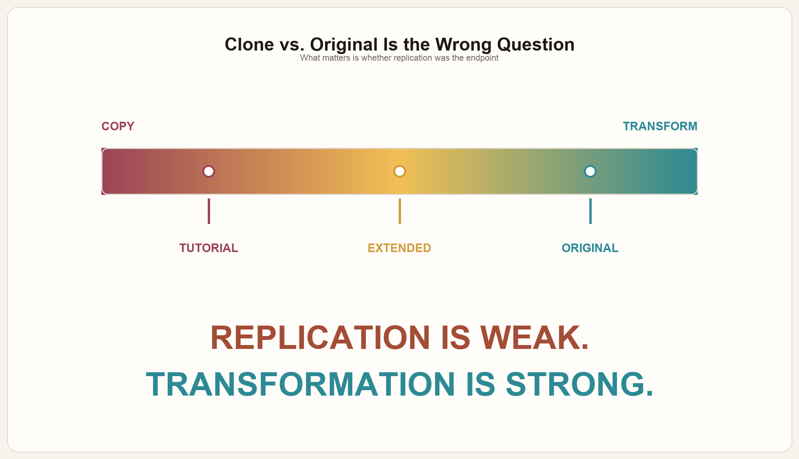

  

<h1 align="center">GitHub Rabbit Hole</h1>

  Research, theory, and practical workflows for writing stronger GitHub READMEs.

Most README “best practices” are not rules. They are signals reviewers use under time pressure.

This repository is for developers who are looking for work and want to understand README best practices from the other side of the table. It is not mainly a formatting guide. It is an attempt to understand how GitHub repositories are seen by:

- recruiters doing first-pass filtering,
- hiring managers deciding whether to keep looking,
- and technical reviewers or team leads looking for evidence that a project is real, thoughtful, and competently built.

It is also an attempt to study attention itself under modern conditions:

- too much noise,
- too many repeated “best practices,”
- too little time,
- and the constant pressure of fragmented attention.

If you want to know why screenshots, tests, `.env.example`, live demos, commit quality, and project framing matter, this repo is meant to make those signals legible.

## Start Here

<table>
  <tr>
    <td width="50%" valign="top">
      <h3>Research</h3>
      
Full investigation, claim verification, direct quotations, caveats, and references.

      
<a href="./docs/research-report.en.md"><strong>Open file</strong></a>

    </td>
    <td width="50%" valign="top">
      <h3>Practice</h3>
      
What to show in a demo video and how to present the project clearly.

      
<a href="./docs/video-guide.en.md"><strong>Open file</strong></a>

    </td>
  </tr>
</table>

## Visual Frames

These three visuals summarize the argument:

  

<strong>1. A repository is filtered before code is read.</strong>

The first job of a README is not to explain everything. Its first job is to survive the first pass, reduce uncertainty, and earn another minute of attention. That is why first-screen clarity matters more than completeness.

  

<strong>2. Not every README signal carries the same weight.</strong>

Some details compress much more information than others. A live demo, real deployment, clear problem statement, tests, or thoughtful trade-offs tell a reviewer how you work. Other details, like decorative badges, add much less on their own.

  

<strong>3. The real distinction is endpoint vs. transformation.</strong>

The problem with clones is usually not resemblance. The problem is stopping at replication. A project becomes stronger when it is extended, deployed, shaped by real constraints, or pushed far enough that it shows independent judgment.

## Coding LLM Agent Skills

These two files are meant to be reused as skills for coding LLM agents, not just read as notes.

<table>
  <tr>
    <td width="50%" valign="top">
      <h3>README Writer Skill</h3>
      
A portable skill for coding LLM agents that inspect a repository, extract only defensible facts, and write a concise README that behaves like a landing page instead of a dump of documentation.

      
<a href="./docs/skill-readme-writer.en.md"><strong>Open skill</strong></a>

    </td>
    <td width="50%" valign="top">
      <h3>Demo Video Skill</h3>
      
A portable skill for coding LLM agents that structure short project walkthroughs, lead with the result, and turn a demo into a clearer hiring signal instead of an unfocused screen recording.

      
<a href="./docs/skill-video-demo.en.md"><strong>Open skill</strong></a>

    </td>
  </tr>
</table>

## Published Article

[The Great README Hunt: What README “Best Practices” Actually Signal](https://medium.com/@kazkozdev/the-great-readme-hunt-what-readme-best-practices-actually-signal-d9df9782b512)
